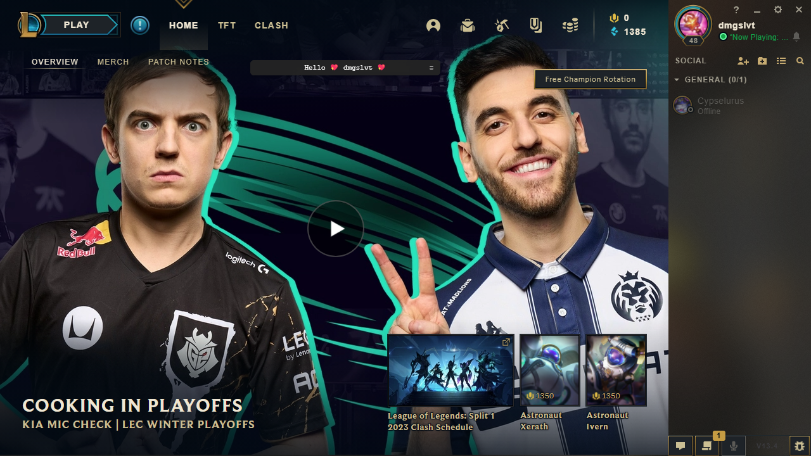
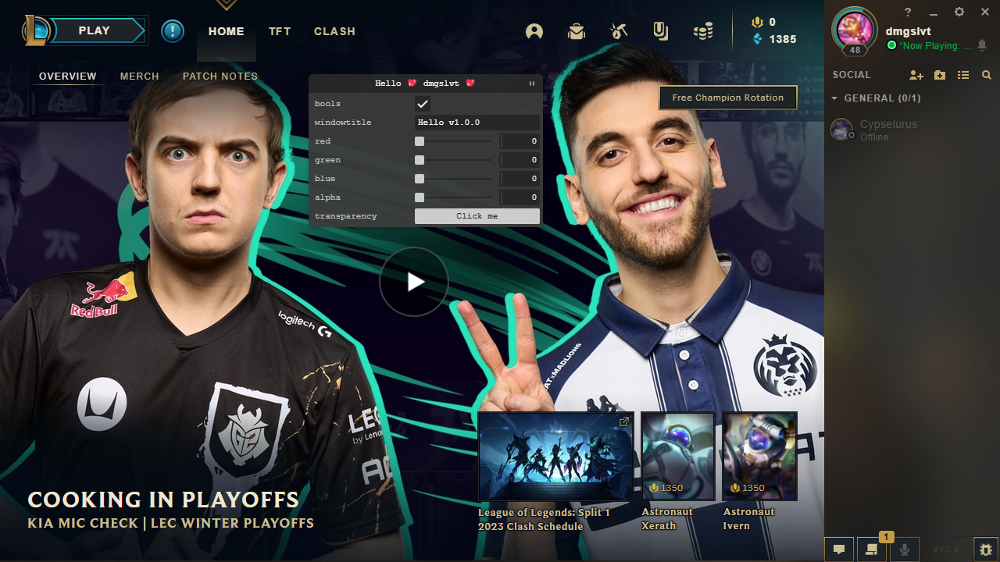

# riot-tweakpane

tweakpane integration into league of legends client

## Documentation

Tweakpane Doc can be found [here](https://tweakpane.github.io/docs/)  
v3 to v4 migration documentation can be found here [Version 3.x To 4.x](https://tweakpane.github.io/docs/migration/v4/)

